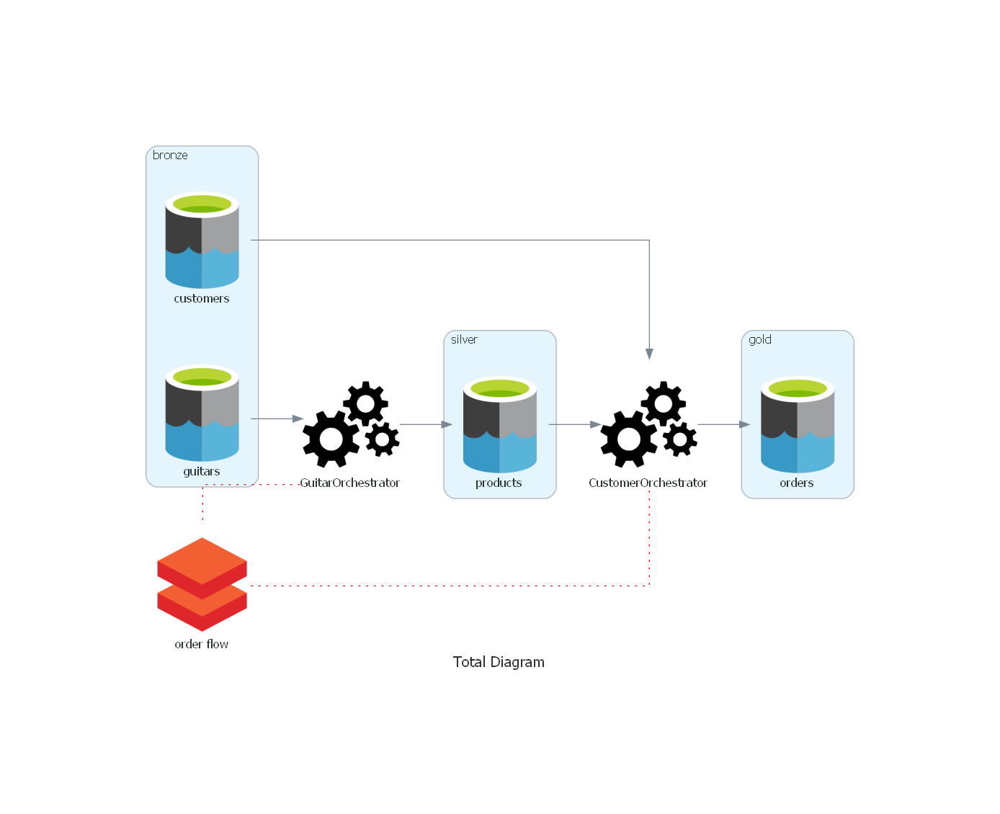
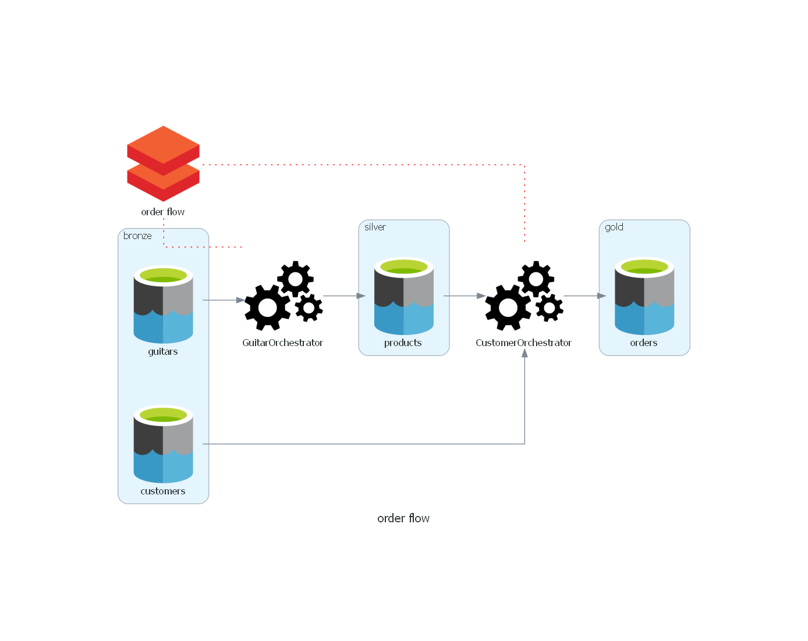
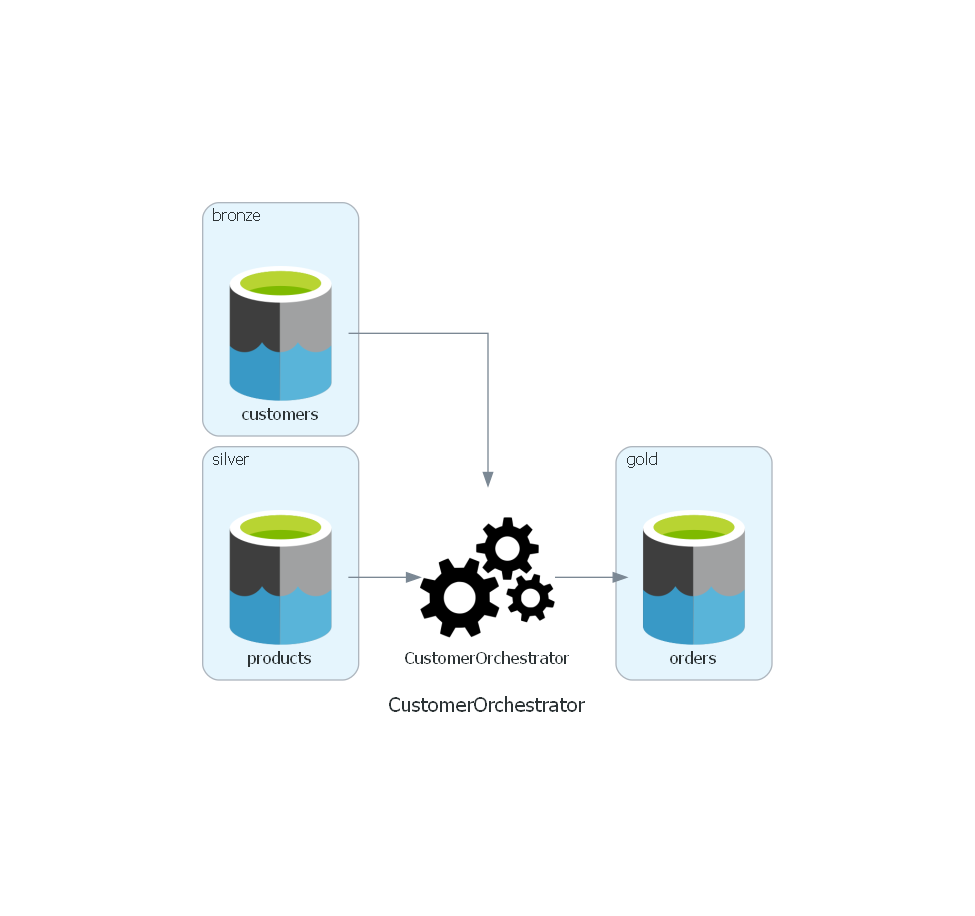

# Automatic Diagram Documentation

## Introduction

Create files like

```
{tables}
```

```
{CustomerOrchestrator}
```

```
{GuitarOrchestrator}
```

```
{GuitarOrchestrator}
```

then finally execute them like this:

```
{diagram}
```
Run `python diagram.py`

You will get diagrams like this:



